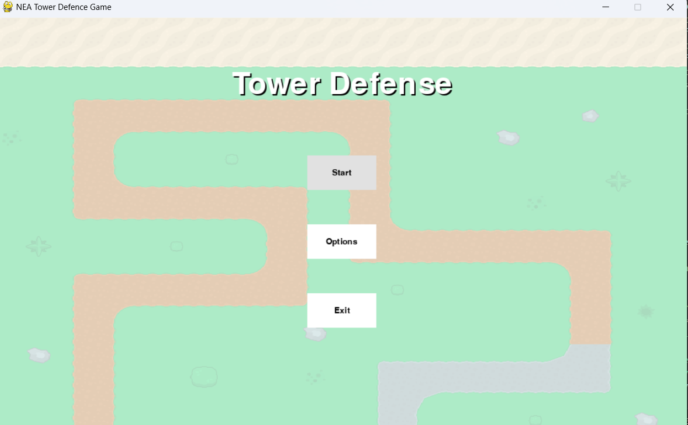

# Pygame Tower Defense



## Overview

This is a simple tower defense game built using Python and Pygame. The objective of the game is to defend your base from waves of enemies by strategically placing defensive towers along their path.

## Features

- 3 types of towers: basic, sniper, and missile launcher.
- Multiple levels with increasing difficulty.
- Different types of enemies with unique characteristics.
- Upgrade system for towers.

## Getting Started

### Prerequisites

- Python 3.x
- Pygame

### Installation

1. Clone the repository:

    ```sh
    git clone https://github.com/yourusername/tower-defense.git
    ```

2. Install Pygame if you haven't already:

    ```sh
    pip install pygame
    ```

### Usage

Run the following command to start the game:

```sh
python main.py
